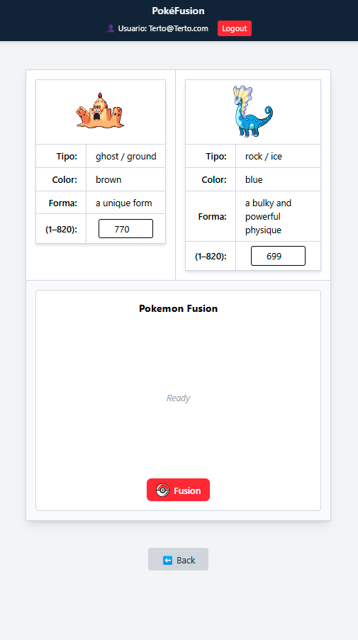

# 🔥 PokéFusion App

Generador visual de fusiones Pokémon basado en sus tipos, colores y formas. Este proyecto permite fusionar dos Pokémon y generar una imagen única usando una API de imagen generativa, además de guardar y mostrar las últimas fusiones generadas.

---

## 🧩 Características
- Frontend moderno con React, Vite y TailwindCSS
- Backend robusto con Express y SQLite (better-sqlite3)
- Generación de fusiones Pokémon con IA usando prompts dinámicos
- Autenticación de usuarios con JWT (registro, login, logout)
- Gestión segura de contraseñas con bcrypt
- Visualización de las últimas 12 fusiones (imágenes generadas)
- Almacenamiento de fusiones en base de datos con:
- Protección de rutas: solo los usuarios registrados pueden acceder al fusionador
- Header persistente que muestra si estás logueado y tu email
- Script make db para inspeccionar la base de datos (sqlite3)
- Compatible con despliegue local usando Makefile + Docker
- Modo backend en segundo plano (make upBackend con node index.js &)

---

## 📸 Vista del Proyecto




---

## 🚀 Instalación Rápida

```bash
# Clonar repositorio
git clone https://github.com/tuusuario/Globant-Pokeapi.git
cd Globant-Pokeapi

# Comprueba entorno instalado e instala cosas necesarias
make build

# Levantar el proyecto completo
make up

# Cerrar el proyecto
make down
```


## Consultas de la db

```bash
# Revisar la db
make db

```